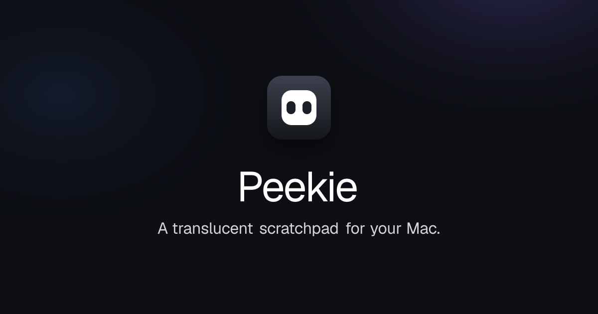

<p align="center">
  
</p>

<p align="center">
  <a href="https://github.com/maxbenschop/peekie-website/actions/workflows/ci.yml"></a>
  
  <a href="LICENSE"></a>
</p>

# Peekie website

The marketing site for [Peekie](https://github.com/maxbenschop/peekie), a translucent scratchpad for macOS. Built with Next.js (App Router) and deployed on Vercel.

## What it does

A single landing page: hero with a live demo animation, features grid, an interactive appearance demo, shortcuts reference, privacy section, FAQ, and a download section. The version badge, changelog blurb and download button pull live from the [Peekie GitHub releases API](https://api.github.com/repos/maxbenschop/peekie/releases/latest), cached for an hour, so the site always reflects the latest release without a manual update.

## Developing

You need Node.js 20 or later.

```sh
npm install
npm run dev
```

Opens at [http://localhost:3000](http://localhost:3000).

Other scripts:

| Script | What it does |
| --- | --- |
| `npm run build` | Production build |
| `npm run lint` | ESLint |
| `npm start` | Serve the production build |

## Structure

```
app/              Routes, layout, metadata, robots.txt, sitemap.xml, OG image
components/       Page sections (client components for interactive demos)
lib/              GitHub release fetching, site constants
public/           Static assets (icons, wallpaper)
```

Sections are plain React function components with inline styles for anything dynamic and shared CSS classes (`app/globals.css`) for layout. No CSS framework, no component library.

## Deployment

Deploys to Vercel on every push to `main`, with preview deployments for pull requests.

## Contributing

See [CONTRIBUTING.md](CONTRIBUTING.md). Please follow the [code of conduct](CODE_OF_CONDUCT.md).

## License

[MIT](LICENSE) © Max Benschop
